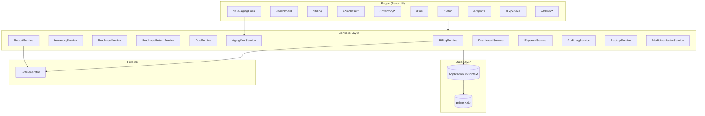

# PrimeRx — Code Map

Complete reference of project structure, classes, methods, and what each part does.

**App:** ASP.NET Core 10 Razor Pages · **Database:** SQLite · **Auth:** Identity (Admin / Staff)

---

## Architecture Overview



---

## Folder Structure

```
PrimeRx/
├── PrimeRx/
│   ├── Program.cs                 # App startup, DI, auth policies, middleware pipeline, auto-update check, Serilog
│   ├── Data/
│   │   ├── ApplicationDbContext.cs  # EF Core DbContext ~20 DbSets, indices, relationships
│   │   ├── DatabasePath.cs        # Resolves SQLite file path
│   │   ├── Migrations/            # ~25 EF Core schema migrations
│   │   └── Seeder/
│   │       ├── RoleSeeder.cs      # Seeds Admin & Staff roles
│   │       └── MedicineSeeder.cs  # Optional sample medicines on setup
│   ├── Models/                    # Domain entities & constants
│   ├── Models/ViewModels/         # Request/DTO types for forms & APIs
│   ├── Services/                  # Business logic (10 services)
│   ├── Helpers/                   # PDF generation (QuestPDF)
│   ├── Middleware/                 # First-run setup redirect
│   ├── ViewComponents/            # Reusable UI components
│   ├── Pages/                     # Razor Pages (UI + page handlers)
│   │   ├── Purchase/              # Purchase CRUD + Supplier + Return
│   │   ├── Billing/               # POS, History, Edit
│   │   ├── Inventory/             # Stock, Batches, Expiry, Adjust, StockExchange
│   │   ├── Dashboard/             # Analytics KPIs and charts
│   │   ├── Due/
│   │   │   ├── AgingDues/         # Ageing dues report (supplier + customer)
│   │   │   ├── Payables/Ageing/   # Payable ageing report
│   │   │   ├── Index              # Due bills listing & collection
│   │   │   └── Pay                # Record due payment
│   │   ├── Reports/               # Sales, inventory, profit reports
│   │   ├── Expenses/              # Expense entry
│   │   ├── Notifications/         # Notification center
│   │   └── Admin/                 # Settings, Medicines, Suppliers, Payables, Users, Backup, AuditLog, MedicineMaster
│   └── wwwroot/                   # CSS, JS, static files
│       ├── css/
│       │   ├── site.css           # Design system (dark/light themes)
│       │   ├── billing.css        # Billing & POS styles
│       │   └── purchase.css       # Purchase entry styles (CC, batch info, calc)
│       └── js/
│           ├── billing.js         # POS: search popup, batch picker, margin flags, payment method group
│           └── purchase.js        # Purchase: smart Enter nav, CC, calculator, batch info panel, master data
├── publish/win-x64/               # Self-contained release build
└── CODE_MAP.md                    # This file
```

---

## Program.cs — Startup & Configuration

| Area | What it does |
|------|----------------|
| **Logging** | Serilog with console + daily rolling file (`logs/primerx-*.log`, 30 days retained) |
| **SQLite connection** | Resolves `Data Source=Data/primerx.db` to an absolute path via `DatabasePath.ResolveSqliteConnectionString` |
| **DbContext** | Registers `ApplicationDbContext` with SQLite |
| **Identity** | Email/password auth; 6+ chars, digit required; no email confirmation |
| **Roles** | `Admin`, `Staff` via `AddRoles<IdentityRole>()` |
| **Policies** | `StaffAccess` → Admin or Staff; `AdminOnly` → Admin only |
| **Page auth** | Purchase, Billing, Dashboard, Inventory, Due, Reports, Expenses → Staff; Admin folder → Admin; Setup & Index → anonymous |
| **DI registrations** | `InventoryService`, `BillingService`, `PurchaseService`, `PurchaseReturnService`, `DueService`, `AgingDueService`, `ReportService`, `DashboardService`, `ExpenseService`, `AuditLogService`, `BackupService`, `MedicineMasterService`, `UpdateService` (scoped); `PdfGenerator` (singleton) |
| **Startup migration** | Runs `MigrateAsync()` and `RoleSeeder.SeedAsync()` on launch |
| **Middleware order** | SetupMiddleware → Routing → Authentication → Authorization → Razor Pages |
| **HTTPS** | Only enabled when `ASPNETCORE_URLS` contains `https` |
| **Auto-update** | Background task checks GitHub releases for new versions |
| **Auto-launch** | Opens browser on first start (non-dev, unless `PRIMERX_NO_BROWSER=1`) |

---

## Services

### BillingService

Handles bill creation, stock deduction (FEFO batch-aware), cancellation, editing, tax calculation, and invoice PDFs.

| Method | Visibility | Description |
|--------|------------|-------------|
| `CreateBillAsync(request, staffId, staffName)` | public | Validates items & stock, gathers FEFO batch list, deducts from batches earliest-expiry first, applies company tax, creates bill, logs inventory transactions — all in a DB transaction |
| `UpdateBillAsync(billId, request, staffId, staffName)` | public | Reverses old stock, re-deducts new stock from batches, updates bill line items in a transaction |
| `CancelBillAsync(billId, reason)` | public | Reverses stock to medicine + batch, sets `Status = Cancelled`, logs inventory transaction |
| `ApplyPaymentLogic(bill)` | public static | Sets `PaidAmount`, `DueAmount`, `PaymentStatus` based on Cash/Online vs Due payment |
| `GetByIdAsync(id)` | public | Loads bill with sale items, batch references, and due payments |
| `GenerateInvoicePdfAsync(billId)` | public | Loads bill + company profile, returns PDF bytes via `PdfGenerator` |
| `GenerateBillNumberAsync()` | private | Generates daily sequential number: `BILL-yyyyMMdd-0001` |

---

### PurchaseService

Purchase order creation, editing, deletion with stock/batch updates, credit purchase with auto-payable creation.

| Method | Visibility | Description |
|--------|------------|-------------|
| `GetAllAsync(limit)` | public | Lists purchases with items, ordered by date desc |
| `GetByIdAsync(id)` | public | Loads purchase with items + medicine references |
| `GetBySupplierAsync(supplierName)` | public | Purchases filtered by supplier name |
| `CreateAsync(request, createdBy)` | public | Validates items, updates stock + batch records via `InventoryService.RecordPurchaseAsync`, auto-calculates MRP from margin, creates Credit purchase Payable with available credit note adjustment, auto-backup |
| `UpdateAsync(id, request, updatedBy)` | public | Reverses removed items stock, adjusts changed quantities, adds new items, updates header fields |
| `DeleteAsync(id)` | public | Reverses all item stock, deletes purchase record |
| `GetSuppliersAsync()` | public | Union of Supplier table names + Purchase table supplier names |
| `GetSupplierCreditDaysAsync(supplierName)` | public | Returns credit days from Supplier profile |
| `GetAvailableCreditAsync(supplierName)` | public | Sum of available credit notes for a supplier |
| `ApplyAvailableCreditAsync(supplierName, total)` | private | Applies oldest credit notes first against a new purchase total |

---

### PurchaseReturnService

Handles returning medicines to suppliers with automatic credit note generation.

| Method | Visibility | Description |
|--------|------------|-------------|
| `GetAllAsync(limit)` | public | Lists purchase returns with items |
| `GetByIdAsync(id)` | public | Loads return with items + medicine references |
| `GetBySupplierAsync(supplierName)` | public | Returns filtered by supplier |
| `CreateAsync(request, createdBy)` | public | Validates items, reduces stock via `InventoryService.ReturnToSupplierAsync`, creates purchase return record + `CreditNote` for the return amount |
| `GetCreditNotesAsync(supplierName)` | public | Lists credit notes, optionally filtered by supplier |

**DTOs (same file):**

| Class | Purpose |
|-------|---------|
| `PurchaseReturnLineItem` | One returned item: MedicineId, BatchNumber, Quantity, PurchasePrice |
| `PurchaseReturnCreateRequest` | Full return request: ReturnDate, SupplierName, Items, Reason |

---

### InventoryService

Medicine catalog, stock operations, batch management, master catalog search.

| Method | Visibility | Description |
|--------|------------|-------------|
| `GetAllAsync(search, includeInactive)` | public | Lists medicines; optional name/generic/manufacturer search |
| `SearchMedicinesAsync(term, limit)` | public | Autocomplete search — active medicines with stock > 0 |
| `GetByIdAsync(id)` | public | Single medicine by ID |
| `CreateAsync(medicine)` | public | Adds new medicine, creates initial batch + inventory transaction, auto-calculates MRP |
| `UpdateAsync(medicine)` | public | Updates existing medicine |
| `DeleteAsync(id)` | public | Soft-deletes medicine (`IsActive = false`) |
| `RecordPurchaseAsync(request)` | public | Increases stock, updates purchase price + MRP, creates batch record + inventory transaction |
| `ReturnToSupplierAsync(medicineId, quantity, batchNumber, reference)` | public | Reduces stock + matching batch for purchase returns; validates sufficient stock |
| `AdjustStockAsync(request)` | public | Manual stock +/- with validation (cannot go below 0), adjusts latest batch |
| `GetTransactionHistoryAsync(medicineId, limit)` | public | Recent inventory movements, optionally filtered by medicine |
| `GetLowStockAsync()` | public | Medicines at or below `LowStockThreshold` |
| `GetExpiringSoonAsync(days)` | public | Medicines expiring within N days (default 90) |
| `GetBatchesAsync(medicineId)` | public | All inventory batches, optionally filtered by medicine |
| `GetDefaultMarginPercentAsync()` | public | Default MRP margin from CompanyProfile (falls back to 16%) |
| `CalculateMrp(purchasePrice, marginPercent)` | public static | Computes MRP = purchasePrice × (1 + marginPercent/100) |
| `SearchMasterForAutoFillAsync(term, limit)` | public | Searches MedicineMaster catalog for populating new medicine entries |
| `ExportInventoryStockToExcel()` | public | Exports stock with batch details to Excel (EPPlus) |
| `ExchangeStockAsync(medicineId, quantity, otherPharmacy, reference)` | public | Records stock exchange (Aaicho Paicho) transfer |

---

### DueService

Outstanding bill tracking and payment collection.

| Method | Visibility | Description |
|--------|------------|-------------|
| `GetDueBillsAsync(search)` | public | Lists bills with `DueAmount > 0`; optional customer/bill search |
| `RecordPaymentAsync(request)` | public | Records partial or full payment; updates bill status to Paid or Partially Paid |
| `GetPaymentHistoryAsync(billId)` | public | All due payments for a specific bill |

---

### AgingDueService

Unified ageing report for supplier payables and customer receivables.

| Method | Visibility | Description |
|--------|------------|-------------|
| `GetReportAsync(partyType, fromDate, toDate, asOnDate)` | public | Queries Payables table for supplier dues + Bills (DueAmount > 0) for customer receivables; returns separated lists with age calculations |
| `GetPayableRowsAsync(fromDate, toDate, asOnDate)` | private | Filters and projects payable records into AgingDueRows |
| `GetReceivableRowsAsync(fromDate, toDate, asOnDate)` | private | Filters and projects bill records into AgingDueRows |
| `RenderDueTable(TableDescriptor, rows)` | private static | Renders a QuestPDF table for a list of ageing rows |
| `ExportToPdf(report)` | public | Generates A4 PDF with company header, separate supplier/customer sections, subtotals, age color-coding, grand total |

---

### ReportService

Sales analytics, business reports, and PDF/Excel exports.

| Method | Visibility | Description |
|--------|------------|-------------|
| `GetDailySalesAsync(date)` | public | Bills for one calendar day with totals |
| `GetMonthlySalesAsync(year, month)` | public | Bills for one calendar month with totals |
| `GetMedicineWiseSalesAsync(from, to)` | public | Aggregated quantity & revenue per medicine in date range |
| `GetProfitLossAsync(from, to)` | public | Revenue vs purchase cost; net profit and bill count |
| `GetDueCollectionAsync(from, to)` | public | Total collected via due payments + current outstanding |
| `GetInventoryReportAsync()` | public | Active medicine stock snapshot |
| `GetExpiryReportAsync(days)` | public | Medicines expiring within N days |
| `ExportSalesToExcel(report)` | public | Excel workbook for sales report |
| `ExportMedicineSalesToExcel(rows)` | public | Excel workbook for medicine-wise sales |
| `ExportInventoryToExcel(medicines)` | public | Excel workbook for inventory |
| `ExportSalesToPdf(report)` | public | PDF summary of sales report (QuestPDF) |
| `GetBillsInRangeAsync(start, end)` | private | Queries bills between two dates |
| `BuildSalesReportAsync(bills, title)` | private | Wraps bill list into `SalesReportData` with totals |

**Report DTOs (same file):**

| Class | Purpose |
|-------|---------|
| `SalesReportData` | Daily/monthly sales report payload |
| `MedicineSalesRow` | Per-medicine sales aggregate |
| `ProfitLossReport` | P&L summary |
| `DueCollectionReport` | Due collection summary |

---

### DashboardService

Aggregates KPIs and chart data for the home dashboard.

| Method | Visibility | Description |
|--------|------------|-------------|
| `GetSummaryAsync()` | public | Today/month sales, discount, expenses, net income, profit, due outstanding, stock alerts, recent bills, 7-day trend, top 5 medicines, expenses by category, staff performance |
| `GetSalesTrendAsync(days)` | public | Daily sales amounts for chart (label, amount, bill count) |

**Dashboard DTOs (same file):**

| Class | Properties | Purpose |
|-------|------------|---------|
| `DashboardSummary` | TodaySales, TodayDiscount, MonthSales, MonthBills, MonthDiscount, MonthNet, OutstandingDue, LowStockCount, ExpiringCount, TotalMedicines, RecentBills, SalesTrend, TopMedicines, TodayExpenses, MonthExpenses, TodayProfit, MonthProfit, ExpensesByCategory, StaffPerformance | Full dashboard payload |
| `CategoryAmount` | Category, Label, Amount | Expense category breakdown |
| `StaffSalesRow` | StaffName, BillCount, SalesAmount | Per-staff performance metrics |
| `DailySalesPoint` | Date, Label, Amount, BillCount | One point on the sales trend chart |

---

### ExpenseService

| Method | Visibility | Description |
|--------|------------|-------------|
| `GetTotalExpensesAsync(from, to)` | public | Total expenses in date range |
| `GetExpensesByCategoryAsync(year, month)` | public | Expense amounts grouped by category |
| `GetRecentAsync(limit)` | public | Recent expense records |

### AuditLogService

| Method | Visibility | Description |
|--------|------------|-------------|
| `GetRecentAsync(limit)` | public | Recent audit log entries |
| `LogAsync(userId, userName, action, entityType, entityId, oldValue, newValue)` | public | Creates audit log entry |

### BackupService

| Method | Visibility | Description |
|--------|------------|-------------|
| `GetDbPath()` | public | Extracts SQLite file path from connection string |
| `CreateBackupAsync()` | public | Creates timestamped backup in `~/PrimeRx_Backups/`, checkpoints WAL |
| `DownloadBackupAsync()` | public | Returns current DB bytes (with WAL checkpoint) |
| `ListBackups()` | public | Lists backup files with size, date |
| `RestoreBackupAsync(backupFilePath)` | public | Restores from backup file (saves pre-restore safety copy) |
| `CreateDateRangeBackupAsync(from, to)` | public | Creates date-range-labeled backup |
| `ListDateRangeBackups()` | public | Lists date-range backups |

### MedicineMasterService

| Method | Visibility | Description |
|--------|------------|-------------|
| `GetAllAsync(search)` | public | Lists master catalog entries |
| `CreateAsync(master)` | public | Adds new master entry |
| `UpdateAsync(master)` | public | Updates master entry |
| `DeleteAsync(id)` | public | Soft-deletes master entry |
| `GenerateTemplate()` | public | Generates Excel import template |
| `ImportFromExcelAsync(stream, updateExisting)` | public | Imports master data from Excel with add/update/skip tracking |
| `ExportToExcel(list)` | public | Exports master catalog to Excel |
| `ExportToCsv(list)` | public | Exports master catalog to CSV |

---

## Helpers

### PdfGenerator

| Method | Visibility | Description |
|--------|------------|-------------|
| `GenerateInvoice(bill, company)` | public | Builds A5 PDF invoice with company branding, line items, tax, totals, footer |
| `ParseColor(hex)` | private | Validates hex color for bill header; defaults to `#2563eb` |

Uses company settings: `BillTitle`, `BillPrimaryColor`, `ShowPanOnBill`, `ShowGstinOnBill`, `TaxLabel`, `BillFooterText`.

---

## Middleware

### SetupMiddleware

| Method | Description |
|--------|-------------|
| `InvokeAsync(context, dbContext)` | Redirects all requests to `/Setup` until a `CompanyProfile` exists (except Setup, Error, home, and static assets) |

---

## View Components

### CompanyHeaderViewComponent

| Method | Description |
|--------|-------------|
| `InvokeAsync()` | Loads company profile from DB and renders the pharmacy name banner in the layout |

---

## Data Layer

### ApplicationDbContext

| DbSet | Entity |
|-------|--------|
| `CompanyProfiles` | Pharmacy/company settings |
| `Medicines` | Medicine catalog |
| `MedicineForms` | Medicine form variants (Tablet, Syrup, etc.) |
| `MedicineMasters` | Master catalog (brand, generic, manufacturer) |
| `Bills` | Sales invoices |
| `SaleItems` | Line items on bills (batch-aware) |
| `DuePayments` | Partial/full due collections |
| `InventoryTransactions` | Stock movement audit log |
| `InventoryBatches` | Batch-level stock tracking (FEFO) |
| `Customers` | Customer profiles with loyalty points |
| `Expenses` | Business expense tracking |
| `Payables` | Supplier payables (credit purchases) |
| `Suppliers` | Supplier profiles |
| `Purchases` | Purchase orders |
| `PurchaseItems` | Purchase line items |
| `PurchaseReturns` | Return to supplier records |
| `PurchaseReturnItems` | Return line items |
| `CreditNotes` | Supplier credit notes from returns |
| `AuditLogs` | Entity change audit trail |

**Key Indexes:** Medicine.Name, MedicineForm (MedicineId+FormType), Bill.BillNumber (unique), Bill.BillDate, Bill.CustomerPhone, Customer.Phone, Customer.Name, InventoryBatch (MedicineId+ExpiryDate), Purchase.PurchaseDate, Purchase.SupplierName, PurchaseReturn.ReturnDate, PurchaseReturn.SupplierName, Payable.SupplierName, CreditNote.SupplierName, Supplier.Name, AuditLog.Timestamp, AuditLog.UserId, AuditLog (EntityType+EntityId), MedicineMaster.GenericName, MedicineMaster.BrandName, Expense.ExpenseDate

**Relationships:**
- SaleItem → Bill (Cascade), → Medicine (Restrict), → InventoryBatch (SetNull)
- PurchaseItem → Purchase (Cascade), → Medicine (Restrict)
- PurchaseReturn → Purchase (SetNull), → Items (Cascade)
- CreditNote → PurchaseReturn (Cascade)
- InventoryBatch → Medicine (Cascade), → MedicineForm (Cascade)
- Bill → Customer (SetNull)
- DuePayment → Bill (Cascade)
- InventoryTransaction → Medicine (Restrict)

**Decimal precision:** 18,2 on all decimal columns

### DatabasePath

| Method | Description |
|--------|-------------|
| `ResolveSqliteConnectionString(connectionString, contentRootPath)` | Converts relative `Data Source=` path to absolute; creates directory if missing |

### RoleSeeder

| Method | Description |
|--------|-------------|
| `SeedAsync(roleManager)` | Creates `Admin` and `Staff` roles if they do not exist |

### MedicineSeeder

| Method | Description |
|--------|-------------|
| `SeedAsync(context)` | Inserts sample medicines during first-time setup (optional checkbox) |

---

## Models (Domain Entities)

### CompanyProfile

| Property | Type | Purpose |
|----------|------|---------|
| Id, Name, Address, Phone | int/string | Pharmacy identity |
| PAN, GSTIN | string? | Tax identifiers |
| LogoPath | string? | Future logo support |
| TaxRate, TaxLabel, TaxInclusive | decimal/string/bool | Tax configuration |
| BillTitle, BillFooterText, BillPrimaryColor | string | PDF bill design |
| ShowPanOnBill, ShowGstinOnBill | bool | Toggle PAN/GSTIN on invoice |
| DefaultDiscountMarginPercent | decimal | Default MRP margin % (default 16) |

### Medicine

| Property | Type | Purpose |
|----------|------|---------|
| Id, Name, GenericName, Manufacturer | int/string | Medicine identity |
| MRP, PurchasePrice | decimal | Selling & cost price |
| StockQuantity, LowStockThreshold | int | Stock levels |
| ExpiryDate, Category | DateTime?/string | Expiry & grouping |
| IsActive | bool | Soft delete flag |
| DiscountPercent | decimal | Default discount % (billing) |
| FormType | string? | Tablet, Syrup, Capsule, etc. |
| BatchNumber | string? | Latest batch number |
| PurchaseSource | string? | Latest supplier/ source |

### MedicineForm

Form variant of a medicine. Links Medicine to its batches.

| Property | Type | Purpose |
|----------|------|---------|
| Id, MedicineId | int | PK + FK to Medicine |
| FormType | string | Tablet, Syrup, etc. |
| Strength | string? | "500mg", "100ml" |
| UnitOfMeasure | string | Pieces, ML, mg, Grams |
| MRP, PurchasePrice | decimal | Pricing per form |
| LowStockThreshold | int | Alert level |
| IsActive, CreatedAt | bool/DateTime | Status |
| Batches | collection | Related batch records |

### MedicineMaster

Master catalog (brand + generic + manufacturer reference).

| Property | Type | Purpose |
|----------|------|---------|
| Id | int | PK |
| GenericName, BrandName, Manufacturer | string | Medicine identity |
| Form, Strength, Unit | string? | Form details |
| Category, HSNCode, RackLocation | string? | Classification |
| IsActive, CreatedAt, UpdatedAt | bool/DateTime | Status & timestamps |
| DisplayName | computed | `BrandName (GenericName)` |

### Bill

| Property | Type | Purpose |
|----------|------|---------|
| Id, BillNumber, BillDate | int/string/DateTime | Bill identity |
| CustomerName, CustomerPhone | string | Customer info |
| CustomerId, Customer | int?/Customer? | FK to Customer (optional) |
| TotalAmount, DiscountAmount, TaxAmount, FinalAmount | decimal | Amount breakdown |
| PaymentMethod, PaidAmount, DueAmount, PaymentStatus | string/decimal | Payment state |
| StaffId, StaffName | string? | Who created the bill |
| Status | string | Active / Cancelled |
| CancelledAt, CancelReason | DateTime?/string? | Cancellation info |
| SaleItems, DuePayments | collections | Related records |

### SaleItem

Line item on a bill with batch traceability.

| Property | Type | Purpose |
|----------|------|---------|
| Id, BillId, MedicineId | int | Keys |
| Bill, Medicine, Batch | nav | Related entities |
| BatchId | int? | FK to InventoryBatch |
| MedicineName, PackSize, BatchNumber, ExpiryDate | string?/DateTime? | Item details |
| MRP, Rate, Quantity, DiscountPercent, DiscountAmount, Amount | decimal/int | Pricing & discount |

### DuePayment

Partial payment record: BillId, AmountPaid, PaymentDate, PaymentMethod, Remarks.

### InventoryTransaction

Stock audit: MedicineId, TransactionType (Sale/Purchase/Adjustment/Return/Exchange), QuantityChange, TransactionDate, Reference.

### InventoryBatch

Batch-level stock tracking for FEFO dispensing.

| Property | Type | Purpose |
|----------|------|---------|
| Id, MedicineId, MedicineFormId | int/int? | FK to Medicine + optionally MedicineForm |
| Medicine, MedicineForm | nav | Related entities |
| BatchNumber | string | Batch/lot number |
| Quantity | int | Current stock in this batch |
| PurchasePrice | decimal | Cost price for this batch |
| PurchaseSource | string | Supplier or source name |
| ExpiryDate | DateTime? | Expiry for FEFO ordering |
| CreatedAt | DateTime | When batch was added |

### Purchase

| Property | Type | Purpose |
|----------|------|---------|
| Id, PurchaseDate, CreatedAt | int/DateTime | Purchase identity & timestamps |
| SupplierName, SupplierPhone | string | Supplier info |
| InvoiceNumber | string? | Supplier invoice ref |
| TotalAmount | decimal | Purchase total |
| Notes, CreatedBy | string? | Audit info |
| Items | collection | PurchaseItem list |

### PurchaseItem

| Property | Type | Purpose |
|----------|------|---------|
| Id, PurchaseId, MedicineId | int | Keys |
| Purchase, Medicine | nav | Related entities |
| MedicineName, BatchNumber | string | Item details |
| Quantity, FreeQuantity, PurchasePrice, MRP | int/decimal | Pricing & stock |
| DiscountPercent, ConversionCharge | decimal | Discount & CC per item |
| ExpiryDate | DateTime? | Batch expiry |
| Amount | computed | `Qty×PP×(1−disc%/100)` |

### PurchaseReturn

| Property | Type | Purpose |
|----------|------|---------|
| Id, ReturnDate, CreatedAt | int/DateTime | Return identity |
| SupplierName, InvoiceNumber | string | Supplier info |
| PurchaseId | int? | FK to original purchase |
| Reason | string | Expired/Damaged/WrongSupply/Recall/Other |
| Notes, CreatedBy | string? | Audit info |
| TotalAmount | decimal | Return total |
| Items | collection | PurchaseReturnItem list |

### PurchaseReturnItem

Return line: PurchaseReturnId, MedicineId, MedicineName, BatchNumber, Quantity, PurchasePrice, Amount.

### Customer

| Property | Type | Purpose |
|----------|------|---------|
| Id, Name, Phone, Email, Address | int/string | Customer identity |
| Notes, TotalSpent, LoyaltyPoints | string/decimal/int | History & rewards |
| LastPurchaseDate, CreatedAt | DateTime? | Dates |
| IsActive | bool | Active/inactive |
| Bills | collection | Related bills |

### Supplier

| Property | Type | Purpose |
|----------|------|---------|
| Id, Name, PAN, DdaRegNo | int/string | Supplier identity & tax IDs |
| Address, Phone, Email | string? | Contact info |
| CreditDays | int | Default credit period (30) |
| ContactPerson, IsActive, Notes, CreatedAt | string/bool/DateTime | Status & dates |

### Payable

| Property | Type | Purpose |
|----------|------|---------|
| Id, SupplierName, InvoiceNo | int/string | Payable identity |
| Amount, PaidAmount, DueDate, Status | decimal/DateTime/string | Financial state (Pending/Partial/Paid) |
| Description, CreatedAt | string/DateTime | Notes |
| PendingAmount | computed | `Amount − PaidAmount` |
| IsOverdue | computed | `Status≠Paid && DueDate < today` |

### CreditNote

| Property | Type | Purpose |
|----------|------|---------|
| Id, SupplierName, PurchaseReturnId | int/string/int | Credit note identity |
| PurchaseReturn | nav | Related return |
| Amount, UsedAmount, Status | decimal/string | Available/PartiallyUsed/FullyUsed |
| AvailableAmount | computed | `Amount − UsedAmount` |

### Expense

| Property | Type | Purpose |
|----------|------|---------|
| Id, ExpenseDate, CreatedAt | int/DateTime | Expense identity |
| Amount, Category | decimal/string | Financial & category |
| Reason, Notes, StaffId | string? | Details |
| CreatedBy, LastModifiedBy, LastModifiedAt | string?/DateTime? | Audit trail |

### AuditLog

| Property | Type | Purpose |
|----------|------|---------|
| Id, UserId, UserName | int/string | Who performed the action |
| Action, EntityType, EntityId | string/int? | What was done |
| OldValue, NewValue | string? | Before/after state |
| IPAddress, Timestamp | string/DateTime | When & from where |

### AppConstants

| Class | Values |
|-------|--------|
| `AppRoles` | Admin, Staff |
| `PaymentMethods` | Cash, Online, Due |
| `BillStatuses` | Active, Cancelled |
| `PaymentStatuses` | Paid, Partially Paid, Due |
| `TransactionTypes` | Sale, Purchase, Adjustment, Return, Exchange |
| `PayableStatus` | Pending, Partial, Paid |
| `ExpenseCategories` | Purchase, StaffSalary, Rent, Utilities, Transport, Miscellaneous (+ Display method) |
| `PurchaseReturnReasons` | Expired, Damaged, WrongSupply, Recall, Other (+ Display method) |
| `CreditNoteStatus` | Available, PartiallyUsed, FullyUsed |

---

## View Models

| Class | Used by | Purpose |
|-------|---------|---------|
| `BillLineItem` | Billing UI | One row in the billing cart (with SelectedBatchId) |
| `CreateBillRequest` | BillingService | Bill creation payload |
| `MedicineSearchResult` | Billing autocomplete | Slim medicine search result (includes FormType) |
| `RecordDuePaymentRequest` | DueService | Due payment form |
| `PurchaseEntryRequest` | InventoryService | Stock purchase form (includes FreeQuantity, BatchNumber) |
| `StockAdjustmentRequest` | InventoryService | Manual stock adjustment form |
| `PurchaseLineItem` | Purchase UI | One row in purchase entry (includes ConversionCharge, MRP, FreeQuantity, GenericName) |
| `PurchaseCreateRequest` | PurchaseService | Purchase creation payload (with PaymentType, CreditDays) |
| `PurchaseReturnLineItem` | PurchaseReturn UI | One returned item |
| `PurchaseReturnCreateRequest` | PurchaseReturnService | Return creation request |
| `AgingDueRow` | AgingDues page | Single due entry: PartyName, PartyType, Date, InvoiceNo, Narration, Amount, PaidAmount, Balance, AgeDays |
| `AgingDueReport` | AgingDues page | Full report with SupplierRows, CustomerRows, SupplierTotal, CustomerTotal, GrandTotal, filter state, PDF export |

---

## Razor Pages — Handlers

### Public / Setup

| Page | Route | Handler | Description |
|------|-------|---------|-------------|
| **Index** | `/` | `OnGet` | Redirects authenticated users to Dashboard |
| **Setup/Index** | `/Setup` | `OnGet` | Shows wizard if no company exists; else redirect to Dashboard |
| | | `OnPost` | Creates company profile, admin user, optional sample medicines, signs in |
| **Error** | `/Error` | `OnGet` | Error page display |
| **Privacy** | `/Privacy` | `OnGet` | Privacy policy page |

### Dashboard

| Page | Route | Handler | Description |
|------|-------|---------|-------------|
| **Dashboard/Index** | `/Dashboard` | `OnGetAsync` | Loads summary stats with sales, expenses, profit, staff perf, chart JSON (camelCase) |

### Billing

| Page | Route | Handler | Description |
|------|-------|---------|-------------|
| **Billing/Index** | `/Billing` | `OnGet` | Shows billing form; displays success message after bill creation |
| | | `OnGetSearchAsync` | JSON API: returns medicine search results (name, genericName, mrp, stock, discountPercent, formType, isMaster) |
| | | `OnGetSearchMasterAsync` | JSON API: searches master catalog for auto-fill |
| | | `OnGetBatchesAsync` | JSON API: returns batches with stock > 0 for a medicine |
| | | `OnPostAsync` | Creates bill via `BillingService.CreateBillAsync` |
| | | `OnGetDownloadPdfAsync` | Downloads invoice PDF for a bill |
| **Billing/Edit** | `/Billing/Edit` | `OnGetAsync` | Loads bill for editing, serializes existing items + batches |
| | | `OnPostAsync` | Updates bill via `BillingService.UpdateBillAsync` |
| **Billing/History** | `/Billing/History` | `OnGetAsync` | Lists past bills with optional search |
| | | `OnPostCancelAsync` | Cancels a bill via `BillingService.CancelBillAsync` |

### Purchase

| Page | Route | Handler | Description |
|------|-------|---------|-------------|
| **Purchase/Index** | `/Purchase` | `OnGetAsync` | Lists purchases with supplier/date filter, delete button |
| | | `OnPostDeleteAsync` | Deletes purchase + reverses stock |
| **Purchase/Create** | `/Purchase/Create` | `OnGetAsync` | Purchase entry form with margin, known suppliers, date |
| | | `OnGetSearchAsync` | JSON API: searches medicines + master catalog for auto-fill |
| | | `OnPostAsync` | Creates purchase with items, stock/batch update, optional payable |
| **Purchase/Edit** | `/Purchase/Edit` | `OnGetAsync` | Loads purchase for editing, serializes existing items |
| | | `OnGetSearchAsync` | JSON API: searches medicines |
| | | `OnPostAsync` | Updates purchase, adjusts stock differences |
| **Purchase/Supplier** | `/Purchase/Supplier` | `OnGetAsync` | Supplier detail page: purchases, payables, stats, top medicines |
| **Purchase/Return/Index** | `/Purchase/Return` | `OnGetAsync` | Lists purchase returns + credit notes |
| **Purchase/Return/Create** | `/Purchase/Return/Create` | `OnGet` | Return entry form |
| | | `OnGetSearchAsync` | JSON API: searches medicines for return |
| | | `OnPostAsync` | Creates return, reduces stock, auto-creates credit note |

### Inventory

| Page | Route | Handler | Description |
|------|-------|---------|-------------|
| **Inventory/Index** | `/Inventory` | `OnGetAsync` | Medicine list with search; low-stock & expiry alerts |
| **Inventory/AddMedicine** | `/Inventory/AddMedicine` | `OnPostAsync` | Staff/Admin adds new medicine (with auto-batch creation) |
| **Inventory/Adjust** | `/Inventory/Adjust` | `OnGetAsync` | Stock adjustment form |
| | | `OnPostAsync` | Applies manual stock change |
| **Inventory/Batches** | `/Inventory/Batches` | `OnGetAsync` | Lists all batches with stock > 0, searchable |
| **Inventory/Expiry** | `/Inventory/Expiry` | `OnGetAsync` | Medicines expiring within N days |
| **Inventory/History** | `/Inventory/History` | `OnGetAsync` | Inventory transaction log |
| **Inventory/StockExchange** | `/Inventory/StockExchange` | `OnGetAsync` | Stock exchange form + recent exchanges |
| | | `OnPostAsync` | Records exchange (Aaicho Paicho) to another pharmacy |

### Due Payments

| Page | Route | Handler | Description |
|------|-------|---------|-------------|
| **Due/Index** | `/Due` | `OnGetAsync` | Lists outstanding due bills |
| **Due/Pay** | `/Due/Pay` | `OnGetAsync` | Payment form for a specific bill |
| | | `OnPostAsync` | Records payment via `DueService.RecordPaymentAsync` |
| **Due/AgingDues/Index** | `/Due/AgingDues` | `OnGetAsync` | Unified ageing dues report with supplier/customer sections |
| | | `OnGetSupplierPdfAsync` | Exports supplier payables to PDF (QuestPDF) |
| | | `OnGetCustomerPdfAsync` | Exports customer receivables to PDF (QuestPDF) |

### Reports

| Page | Route | Handler | Description |
|------|-------|---------|-------------|
| **Reports/Index** | `/Reports` | `OnGetAsync` | Dashboard stats + chart data (30-day trend, top medicines) |
| | | `OnGetDailySalesAsync` | Daily sales — view / PDF / Excel |
| | | `OnGetMonthlySalesAsync` | Monthly sales — view / PDF / Excel |
| | | `OnGetMedicineSalesAsync` | Medicine-wise sales — view / Excel |
| | | `OnGetProfitLossAsync` | Profit & loss report (30 days) |
| | | `OnGetDueCollectionAsync` | Due collection summary |
| | | `OnGetInventoryAsync` | Inventory snapshot — view / Excel |
| | | `OnGetExpiryAsync` | Expiry alert report (90 days) |

### Expenses

| Page | Route | Handler | Description |
|------|-------|---------|-------------|
| **Expenses/Add** | `/Expenses/Add` | `OnGetAsync` | Expense entry form |
| | | `OnPostAsync` | Creates expense record |

### Notifications

| Page | Route | Handler | Description |
|------|-------|---------|-------------|
| **Notifications/Index** | `/Notifications` | `OnGetAsync` | Notification center |

### Admin (Admin role only)

| Page | Route | Handler | Description |
|------|-------|---------|-------------|
| **Admin/Settings/Index** | `/Admin/Settings` | `OnGetAsync` | Company, tax, bill design settings with live preview |
| | | `OnPostAsync` | Saves company profile settings |
| **Admin/Company/Index** | `/Admin/Company` | `OnGet/OnPost` | Redirects to Settings (legacy route) |
| **Admin/Medicines/Index** | `/Admin/Medicines` | `OnGetAsync` | Full medicine catalog management |
| | | `OnPostDeleteAsync` | Soft-deletes a medicine |
| **Admin/Medicines/Create** | `/Admin/Medicines/Create` | `OnPostAsync` | Creates medicine (admin form) |
| **Admin/Medicines/Edit** | `/Admin/Medicines/Edit` | `OnGetAsync` | Edit medicine form |
| | | `OnPostAsync` | Updates medicine |
| **Admin/Users/Index** | `/Admin/Users` | `OnGetAsync` | Staff account list |
| | | `OnPostCreateAsync` | Creates new Staff user |
| **Admin/Suppliers/Index** | `/Admin/Suppliers` | `OnGetAsync` | Supplier list management |
| **Admin/Suppliers/Add** | `/Admin/Suppliers/Add` | `OnPostAsync` | Creates new supplier |
| **Admin/Suppliers/Edit** | `/Admin/Suppliers/Edit` | `OnGetAsync` | Edit supplier form |
| | | `OnPostAsync` | Updates supplier |
| **Admin/Payables/Index** | `/Admin/Payables` | `OnGetAsync` | Payables list with ageing buckets, filters, summary stats |
| | | `OnPostRecordPaymentAsync` | Records partial payment against payable |
| | | `OnPostMarkPaidAsync` | Marks payable as fully paid |
| | | `OnPostDeleteAsync` | Deletes payable |
| **Admin/Payables/Create** | `/Admin/Payables/Create` | `OnPostAsync` | Creates manual payable |
| **Admin/Backup/Index** | `/Admin/Backup` | `OnGet` | Lists backups |
| | | `OnPostCreateAsync` | Creates new backup |
| | | `OnPostDateRangeBackupAsync` | Creates date-range backup |
| | | `OnPostDownloadAsync` | Downloads current DB |
| | | `OnPostRestoreAsync` | Uploads & restores backup file |
| | | `OnPostRestoreFromServerAsync` | Restores from server-side backup |
| **Admin/AuditLog/Index** | `/Admin/AuditLog` | `OnGetAsync` | Lists recent audit log entries |
| **Admin/MedicineMaster/Index** | `/Admin/MedicineMaster` | `OnGetAsync` | Master catalog management |
| | | `OnGetTemplateAsync` | Downloads Excel import template |
| | | `OnGetExportAsync` | Exports to Excel |
| | | `OnGetExportCsvAsync` | Exports to CSV |
| | | `OnPostImportAsync` | Imports from Excel with add/update/skip |
| **Admin/Expenses/Index** | `/Admin/Expenses` | `OnGetAsync` | Expense list |
| **Admin/Expenses/Create** | `/Admin/Expenses/Create` | `OnPostAsync` | Creates expense |

---

## Key Workflows

### 1. First Launch

```
Browser → SetupMiddleware (no company) → /Setup
Setup OnPost → CompanyProfile + Admin user + optional MedicineSeeder
Sign in → /Billing
```

### 2. Create Bill

```
Billing/Index OnPost
  → BillingService.CreateBillAsync
    → Gather FEFO batches (earliest expiry first)
    → Validate stock + batch availability
    → Create SaleItems with BatchId reference
    → Deduct from batches (FEFO order)
    → Deduct from medicine stock
    → Apply tax from CompanyProfile
    → ApplyPaymentLogic (Cash/Online/Due)
    → InventoryTransaction for each item
  → Redirect with success + billId
Billing/Index OnGetDownloadPdf → PdfGenerator.GenerateInvoice
```

### 3. Cancel Bill

```
Billing/History OnPostCancelAsync
  → BillingService.CancelBillAsync
    → Reverse stock to medicine + batch
    → InventoryTransaction per item
    → Set Status = Cancelled, CancelledAt, CancelReason
```

### 4. Edit Bill

```
Billing/Edit OnPostAsync
  → BillingService.UpdateBillAsync
    → Reverse all old stock
    → Remove old SaleItems
    → Re-deduct stock using current FEFO batches
    → Create new SaleItems
    → Recalculate totals, tax, payment logic
```

### 5. Purchase Entry

```
Purchase/Create OnPostAsync
  → PurchaseService.CreateAsync
    → For each item:
      → InventoryService.RecordPurchaseAsync
        → Increase medicine stock
        → Update purchase price + MRP (via margin%)
        → Create InventoryBatch
        → InventoryTransaction
    → Calculate total (including CC)
    → If Credit payment:
      → Apply available credit notes
      → Create Payable with due date
    → Auto backup
```

### 6. Purchase Return

```
Purchase/Return/Create OnPostAsync
  → PurchaseReturnService.CreateAsync
    → For each item:
      → InventoryService.ReturnToSupplierAsync
        → Reduce stock
        → Reduce matching batch
        → InventoryTransaction (Return type)
    → Create PurchaseReturn + Items
    → Create CreditNote for total amount
```

### 7. Collect Due Payment

```
Due/Pay OnPost
  → DueService.RecordPaymentAsync
    → Validate amount ≤ DueAmount
    → Create DuePayment
    → Update PaidAmount, DueAmount, PaymentStatus
```

### 8. Generate Report

```
Reports/Index OnGetDailySalesAsync (format=view|pdf|excel)
  → ReportService.GetDailySalesAsync
  → view: render table on page
  → pdf: ReportService.ExportSalesToPdf
  → excel: ReportService.ExportSalesToExcel
```

### 9. Medicine Search Floating Popup (client-side, billing.js)

```
User focuses empty search input
  → showRecent()
    → reads localStorage "primerx_recent_meds" (max 8 entries)
    → renders "Recently Used" section in popup

User types in search input (≥1 char, debounced 180ms)
  → fetchAndRender(term)
    → shows spinner immediately
    → GET /Billing?handler=Search&term=… OR /Purchase/Create?handler=Search&term=…
      → InventoryService.SearchMedicinesAsync(term) + master catalog
    → renders up to 20 result rows with stock badge (green/amber/red)

User selects result (click or Enter)
  → selectMedicine(m)
    → saveRecent(m) — prepends to localStorage, deduplicates, trims to 8
    → addItem(m) — adds row to table, recalculates totals
    → closes popup, clears input, refocuses

Popup positioning
  → position: fixed, coordinates from getBoundingClientRect()
  → flips above input if insufficient space below
  → repositions on window resize / scroll
```

### 10. Batch Picker (client-side, billing.js)

```
User clicks batch button on a bill line item
  → openBatchPicker(btn, item, tr)
    → Fetches GET /Billing?handler=Batches&medicineId=N
    → Renders popup with "Auto (FEFO)" + each batch: number, qty, expiry
    → User selects a batch or sticks with Auto
    → Updates item.batchId, batchNumber, expiryDate
    → Adjusts qty input max to batch quantity
    → Shows selected batch label on button
```

### 11. Smart Keyboard Navigation — Purchase (client-side, purchase.js)

```
Smart Enter: Batch# → Expiry → Qty → Free → Rate → Disc% → CC → MRP
  → At MRP or last field: focuses search input for next medicine
Arrow Up/Down: Navigate between rows in same column
Right-click or Ctrl+Shift+C: Opens floating calculator on Qty/Rate/CC fields
Batch Info Panel: Shows medicine details (generic, manufacturer, form, strength)
  on Batch# field focus
```

---

## Authorization Matrix

| Area | Admin | Staff | Anonymous |
|------|:-----:|:-----:|:---------:|
| Setup | ✓ | ✓ | ✓ |
| Dashboard | ✓ | ✓ | |
| Billing | ✓ | ✓ | |
| Purchase | ✓ | ✓ | |
| Inventory | ✓ | ✓ | |
| Due | ✓ | ✓ | |
| Reports | ✓ | ✓ | |
| Expenses | ✓ | ✓ | |
| Admin/* | ✓ | | |

---

## External Libraries

| Library | Used in | Purpose |
|---------|---------|---------|
| Entity Framework Core | Data layer | ORM, migrations |
| ASP.NET Core Identity | Auth | Users & roles |
| QuestPDF | PdfGenerator, ReportService | PDF invoices & reports |
| EPPlus | ReportService, InventoryService, MedicineMasterService | Excel exports & imports |
| Chart.js | Dashboard, Reports | Sales & medicine charts |
| Bootstrap 5 | All pages | UI framework |
| Serilog | Program.cs | Structured logging (console + file) |

---

## Database Migrations

| Migration | Description |
|-----------|-------------|
| `InitialCreate` | Core tables: Identity, CompanyProfile, Medicine, Bill, SaleItem, DuePayment, InventoryTransaction |
| `AddCompanySettingsAndBillTax` | Tax fields on CompanyProfile, bill design settings, Bill.TaxAmount |
| `AddDefaultDiscountMarginPercent` | Adds DefaultDiscountMarginPercent to CompanyProfile |
| `AddSaleItemPharmacyFields` | BatchId, BatchNumber, PackSize, ExpiryDate, MRP, DiscountAmount on SaleItem |
| `Phase2_Margin16_Batch_PurchaseSource` | Margin 16% default, BatchNumber, PurchaseSource on Medicine |
| `Phase4_Expense_Tracking` | Expense entity |
| `AddMedicineDiscountPercent` | DiscountPercent on Medicine |
| `UpdateDiscountFields` | Discount fields refinements |
| `AddBillCancellationColumns` | Status, CancelledAt, CancelReason on Bill |
| `AddBillCancellationSupport` | Additional cancellation support columns |
| `AddBillGeneratedBy` | StaffId, StaffName on Bill |
| `UpdateBillCustomerPhoneNullable` | CustomerPhone nullable |
| `AddPayables` | Payable entity |
| `AddExpenseAuditColumns` / `FixExpenseAuditColumns` | Audit trail on Expenses |
| `AddPurchaseModule` | Purchase, PurchaseItem entities |
| `AddSupplierTable` | Supplier entity |
| `AddPurchaseReturnsAndCreditNotes` | PurchaseReturn, PurchaseReturnItem, CreditNote entities |
| `AddAuditLog` | AuditLog entity |
| `AddPhase1CustomerMedicineFormModels` | Customer, MedicineForm, InventoryBatch entities |
| `AddMedicineFormType` | FormType on Medicine |
| `MakeMedicineFormIdNullable` | MedicineFormId nullable on InventoryBatch |
| `AddBillCancellationColumns` | Final cancellation support |
| `AddMedicineMaster` | MedicineMaster entity |
| `AddPurchaseItemConversionCharge` | ConversionCharge on PurchaseItem |

Migrations apply automatically on app startup via `Program.cs`.

---

## Client-Side Modules

### billing.js (`wwwroot/js/billing.js`)

| Function | Purpose |
|----------|---------|
| `addItem(medicine)` | Adds medicine to in-memory `items[]`, calls `renderRow` and `recalcTotals` |
| `renderRow(item)` | Builds a table `<tr>` with batch picker, margin flag, rate/qty/discount inputs, remove button |
| `updateLineTotal(tr, item)` | Recomputes discount amount and line total for one row |
| `updateMarginFlag(tr, item)` | Shows warning flag when effective margin < 5% (high discount) |
| `recalcTotals()` | Sums subtotal, discount, total; serializes `items[]` into hidden `#itemsJson` |
| `positionPopup()` | Computes top/left/width for floating popup; flips above if insufficient space |
| `openPopup()` / `closePopup()` | Shows/hides medicine search popup |
| `setActiveRow(i)` | Wraps index arithmetically, toggles `.active` class |
| `stockBadge(qty)` | Returns coloured badge: green (>20), amber (6–20), red (≤5) |
| `renderPopup(medicines)` | Renders up to 20 result rows and activates first row |
| `loadRecent()` / `saveRecent(m)` | localStorage read/write of recently used medicines |
| `showRecent()` | Renders "Recently Used" section on focus/empty input |
| `selectMedicine(medicine)` | Saves to recents, calls `addItem`, clears input, closes popup |
| `fetchAndRender(term)` | Debounced fetch to search handler |
| `getMarginFlag(rate, purchasePrice, discountPercent)` | Returns HTML for margin warning indicators |
| `openBatchPicker(btn, item, tr)` / `closeBatchPicker()` | Batch selection popup with FEFO auto option |
| `updateBatchDisplay(tr, item)` | Updates batch label + info after selection |
| `loadInitialItems()` | Loads existing bill items for edit mode from `#initialBillData` |
| `setPaymentMethod(value)` | Payment method button group (Cash/Online/Due with phone requirement) |

**localStorage key:** `primerx_recent_meds` — JSON array of up to 8 medicine objects.

### purchase.js (`wwwroot/js/purchase.js`)

| Function | Purpose |
|----------|---------|
| `addItem(medicine)` | Adds medicine to purchase items table |
| `selectMedicine(m)` | Selects medicine from search popup, adds to table, focuses qty |
| `renderTable()` | Builds purchase table with Batch#, Expiry, Qty, Free, Rate, Disc%, CC, MRP columns |
| `bindInput(el, field, transform)` | Binds change event to table inputs |
| `bindQtyRate(el)` | Handles Qty/Rate change + MRP auto-recalc |
| `bindCC(el)` | Handles Conversion Charge input |
| `focusField(idx, field)` | Focuses a specific field in a row |
| `updateTotals()` | Recalculates subtotal, discount, CC, net total (table + sidebar) |
| `serializeItems()` | Serializes items to hidden `#itemsJson` for form submission |
| `fetchMedicines(term)` | Fetches medicine search results (includes master catalog) |
| `renderPopup()` / `showLoadingPopup()` | Renders search popup with stock badges |
| `positionPopup()` | Positions search popup relative to input |
| `moveSel(dir)` | Moves active selection in popup |
| `selectMedicine(m)` | Selects medicine, checks for duplicates, increments qty if already in list |
| `showBatchInfo(anchor, item)` / `hideBatchInfo()` | Batch info panel popup (medicine details) |
| `showCalc(target)` / `hideCalc()` | Floating calculator for Qty/Rate/CC fields |
| Smart Enter navigation | Enter key moves through Batch# → Expiry → Qty → Free → Rate → Disc% → CC → MRP → next search |
| Arrow Up/Down | Navigate between rows in same column |

---

*Last updated: July 2026 — PrimeRx v1*
