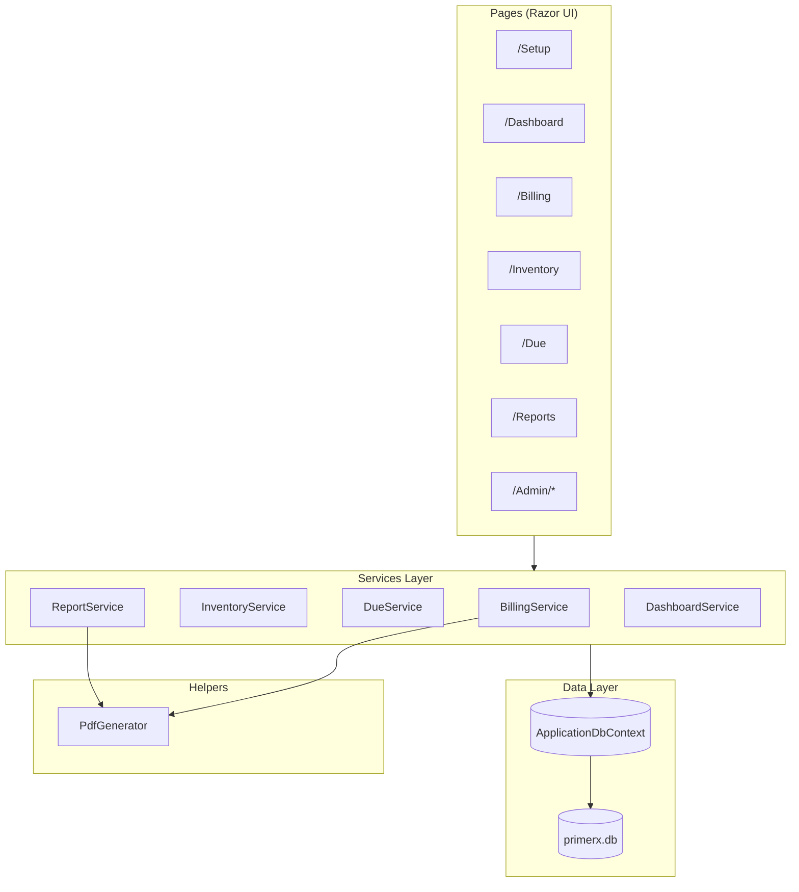

# PrimeRx — Code Map

Complete reference of project structure, classes, methods, and what each part does.

**App:** ASP.NET Core 10 Razor Pages · **Database:** SQLite · **Auth:** Identity (Admin / Staff)

---

## Architecture Overview



---

## Folder Structure

```
PrimeRx/
├── PrimeRx/
│   ├── Program.cs                 # App startup, DI, auth policies, middleware pipeline
│   ├── Data/
│   │   ├── ApplicationDbContext.cs  # EF Core DbContext + entity configuration
│   │   ├── DatabasePath.cs        # Resolves SQLite file path
│   │   ├── Migrations/            # EF Core schema migrations
│   │   └── Seeder/
│   │       ├── RoleSeeder.cs      # Seeds Admin & Staff roles
│   │       └── MedicineSeeder.cs  # Optional sample medicines on setup
│   ├── Models/                    # Domain entities & constants
│   ├── Models/ViewModels/         # Request/DTO types for forms & APIs
│   ├── Services/                  # Business logic
│   ├── Helpers/                     # PDF generation
│   ├── Middleware/                  # First-run setup redirect
│   ├── ViewComponents/            # Reusable UI components
│   ├── Pages/                     # Razor Pages (UI + page handlers)
│   └── wwwroot/                   # CSS, JS, static files
├── publish/win-x64/               # Self-contained release build
└── CODE_MAP.md                    # This file
```

---

## Program.cs — Startup & Configuration

| Area | What it does |
|------|----------------|
| **SQLite connection** | Resolves `Data Source=Data/primerx.db` to an absolute path via `DatabasePath.ResolveSqliteConnectionString` |
| **DbContext** | Registers `ApplicationDbContext` with SQLite |
| **Identity** | Email/password auth; 6+ chars, digit required; no email confirmation |
| **Roles** | `Admin`, `Staff` via `AddRoles<IdentityRole>()` |
| **Policies** | `StaffAccess` → Admin or Staff; `AdminOnly` → Admin only |
| **Page auth** | Billing, Dashboard, Inventory, Due, Reports → Staff; Admin folder → Admin; Setup & Index → anonymous |
| **DI registrations** | `InventoryService`, `BillingService`, `DueService`, `ReportService`, `DashboardService` (scoped); `PdfGenerator` (singleton) |
| **Startup migration** | Runs `MigrateAsync()` and `RoleSeeder.SeedAsync()` on launch |
| **Middleware order** | SetupMiddleware → Routing → Authentication → Authorization → Razor Pages |
| **HTTPS** | Only enabled when `ASPNETCORE_URLS` contains `https` |

---

## Services

### BillingService

Handles bill creation, stock deduction, tax calculation, and invoice PDFs.

| Method | Visibility | Description |
|--------|------------|-------------|
| `CreateBillAsync(request, staffId, staffName)` | public | Validates items & stock, applies company tax, creates bill, deducts stock, logs inventory transactions — all in a DB transaction |
| `ApplyPaymentLogic(bill)` | public static | Sets `PaidAmount`, `DueAmount`, `PaymentStatus` based on Cash/Online vs Due payment |
| `GetByIdAsync(id)` | public | Loads bill with sale items and due payments |
| `GenerateInvoicePdfAsync(billId)` | public | Loads bill + company profile, returns PDF bytes via `PdfGenerator` |
| `GenerateBillNumberAsync()` | private | Generates daily sequential number: `BILL-yyyyMMdd-0001` |

---

### InventoryService

Medicine catalog, stock operations, and inventory history.

| Method | Visibility | Description |
|--------|------------|-------------|
| `GetAllAsync(search, includeInactive)` | public | Lists medicines; optional name/generic/manufacturer search |
| `SearchMedicinesAsync(term, limit)` | public | Autocomplete search — active medicines with stock > 0 |
| `GetByIdAsync(id)` | public | Single medicine by ID |
| `CreateAsync(medicine)` | public | Adds new medicine to catalog |
| `UpdateAsync(medicine)` | public | Updates existing medicine |
| `DeleteAsync(id)` | public | Soft-deletes medicine (`IsActive = false`) |
| `RecordPurchaseAsync(request)` | public | Increases stock and logs a Purchase transaction |
| `AdjustStockAsync(request)` | public | Manual stock +/- with validation (cannot go below 0) |
| `GetTransactionHistoryAsync(medicineId, limit)` | public | Recent inventory movements, optionally filtered by medicine |
| `GetLowStockAsync()` | public | Medicines at or below `LowStockThreshold` |
| `GetExpiringSoonAsync(days)` | public | Medicines expiring within N days (default 90) |

---

### DueService

Outstanding bill tracking and payment collection.

| Method | Visibility | Description |
|--------|------------|-------------|
| `GetDueBillsAsync(search)` | public | Lists bills with `DueAmount > 0`; optional customer/bill search |
| `RecordPaymentAsync(request)` | public | Records partial or full payment; updates bill status to Paid or Partially Paid |
| `GetPaymentHistoryAsync(billId)` | public | All due payments for a specific bill |

---

### ReportService

Sales analytics, business reports, and PDF/Excel exports.

| Method | Visibility | Description |
|--------|------------|-------------|
| `GetDailySalesAsync(date)` | public | Bills for one calendar day with totals |
| `GetMonthlySalesAsync(year, month)` | public | Bills for one calendar month with totals |
| `GetMedicineWiseSalesAsync(from, to)` | public | Aggregated quantity & revenue per medicine in date range |
| `GetProfitLossAsync(from, to)` | public | Revenue vs purchase cost; net profit and bill count |
| `GetDueCollectionAsync(from, to)` | public | Total collected via due payments + current outstanding |
| `GetInventoryReportAsync()` | public | Active medicine stock snapshot |
| `GetExpiryReportAsync(days)` | public | Medicines expiring within N days |
| `ExportSalesToExcel(report)` | public | Excel workbook for sales report |
| `ExportMedicineSalesToExcel(rows)` | public | Excel workbook for medicine-wise sales |
| `ExportInventoryToExcel(medicines)` | public | Excel workbook for inventory |
| `ExportSalesToPdf(report)` | public | PDF summary of sales report (QuestPDF) |
| `GetBillsInRangeAsync(start, end)` | private | Queries bills between two dates |
| `BuildSalesReportAsync(bills, title)` | private | Wraps bill list into `SalesReportData` with totals |

**Report DTOs (same file):**

| Class | Properties | Purpose |
|-------|------------|---------|
| `SalesReportData` | Title, Bills, TotalSales, BillCount | Daily/monthly sales report payload |
| `MedicineSalesRow` | MedicineName, TotalQuantity, TotalAmount | Per-medicine sales aggregate |
| `ProfitLossReport` | Revenue, Cost, Profit, BillCount | P&L summary |
| `DueCollectionReport` | TotalCollected, OutstandingDue, Payments | Due collection summary |

---

### DashboardService

Aggregates KPIs and chart data for the home dashboard.

| Method | Visibility | Description |
|--------|------------|-------------|
| `GetSummaryAsync()` | public | Today/month sales, due outstanding, stock alerts, recent bills, 7-day trend, top 5 medicines |
| `GetSalesTrendAsync(days)` | public | Daily sales amounts for chart (label, amount, bill count) |

**Dashboard DTOs (same file):**

| Class | Properties | Purpose |
|-------|------------|---------|
| `DashboardSummary` | TodaySales, MonthSales, TodayBills, MonthBills, OutstandingDue, LowStockCount, ExpiringCount, TotalMedicines, RecentBills, SalesTrend, TopMedicines | Full dashboard payload |
| `DailySalesPoint` | Date, Label, Amount, BillCount | One point on the sales trend chart |

---

## Helpers

### PdfGenerator

| Method | Visibility | Description |
|--------|------------|-------------|
| `GenerateInvoice(bill, company)` | public | Builds A5 PDF invoice with company branding, line items, tax, totals, footer |
| `ParseColor(hex)` | private | Validates hex color for bill header; defaults to `#2563eb` |

Uses company settings: `BillTitle`, `BillPrimaryColor`, `ShowPanOnBill`, `ShowGstinOnBill`, `TaxLabel`, `BillFooterText`.

---

## Middleware

### SetupMiddleware

| Method | Description |
|--------|-------------|
| `InvokeAsync(context, dbContext)` | Redirects all requests to `/Setup` until a `CompanyProfile` exists (except Setup, Error, home, and static assets) |

---

## View Components

### CompanyHeaderViewComponent

| Method | Description |
|--------|-------------|
| `InvokeAsync()` | Loads company profile from DB and renders the pharmacy name banner in the layout |

---

## Data Layer

### ApplicationDbContext

| DbSet | Entity |
|-------|--------|
| `CompanyProfiles` | Pharmacy/company settings |
| `Medicines` | Medicine catalog |
| `Bills` | Sales invoices |
| `SaleItems` | Line items on bills |
| `DuePayments` | Partial/full due collections |
| `InventoryTransactions` | Stock movement audit log |

**Indexes:** Medicine.Name, Bill.CustomerPhone, Bill.BillNumber (unique)  
**Cascade deletes:** SaleItems, DuePayments on Bill delete  
**Decimal precision:** 18,2 on all decimal columns

### DatabasePath

| Method | Description |
|--------|-------------|
| `ResolveSqliteConnectionString(connectionString, contentRootPath)` | Converts relative `Data Source=` path to absolute; creates directory if missing |

### RoleSeeder

| Method | Description |
|--------|-------------|
| `SeedAsync(roleManager)` | Creates `Admin` and `Staff` roles if they do not exist |

### MedicineSeeder

| Method | Description |
|--------|-------------|
| `SeedAsync(context)` | Inserts sample medicines during first-time setup (optional checkbox) |

---

## Models (Domain Entities)

### CompanyProfile

| Property | Type | Purpose |
|----------|------|---------|
| Id | int | Primary key |
| Name, Address, Phone | string | Pharmacy identity |
| PAN, GSTIN | string | Tax identifiers |
| LogoPath | string? | Future logo support |
| TaxRate, TaxLabel, TaxInclusive | decimal/string/bool | Tax configuration |
| BillTitle, BillFooterText, BillPrimaryColor | string | PDF bill design |
| ShowPanOnBill, ShowGstinOnBill | bool | Toggle PAN/GSTIN on invoice |

### Medicine

| Property | Type | Purpose |
|----------|------|---------|
| Id | int | Primary key |
| Name, GenericName, Manufacturer | string | Medicine identity |
| MRP, PurchasePrice | decimal | Selling & cost price |
| StockQuantity, LowStockThreshold | int | Stock levels |
| ExpiryDate, Category | DateTime?/string | Expiry & grouping |
| IsActive | bool | Soft delete flag |

### Bill

| Property | Type | Purpose |
|----------|------|---------|
| Id, BillNumber, BillDate | int/string/DateTime | Bill identity |
| CustomerName, CustomerPhone | string | Customer info |
| TotalAmount, DiscountAmount, TaxAmount, FinalAmount | decimal | Amount breakdown |
| PaymentMethod, PaidAmount, DueAmount, PaymentStatus | string/decimal | Payment state |
| StaffId, StaffName | string? | Who created the bill |
| SaleItems, DuePayments | collections | Related records |

### SaleItem

Line item on a bill: MedicineId, MedicineName, Rate, Quantity, DiscountPerItem, Amount.

### DuePayment

Partial payment record: BillId, AmountPaid, PaymentDate, PaymentMethod, Remarks.

### InventoryTransaction

Stock audit: MedicineId, TransactionType (Sale/Purchase/Adjustment), QuantityChange, TransactionDate, Reference.

### AppConstants

| Class | Values |
|-------|--------|
| `AppRoles` | Admin, Staff |
| `PaymentMethods` | Cash, Online, Due |
| `PaymentStatuses` | Paid, Partially Paid, Due |
| `TransactionTypes` | Sale, Purchase, Adjustment |

---

## View Models

| Class | Used by | Purpose |
|-------|---------|---------|
| `BillLineItem` | Billing UI | One row in the billing cart |
| `CreateBillRequest` | BillingService | Bill creation payload |
| `MedicineSearchResult` | Billing autocomplete | Slim medicine search result |
| `RecordDuePaymentRequest` | DueService | Due payment form |
| `PurchaseEntryRequest` | InventoryService | Stock purchase form |
| `StockAdjustmentRequest` | InventoryService | Manual stock adjustment form |

---

## Razor Pages — Handlers

### Public / Setup

| Page | Route | Handler | Description |
|------|-------|---------|-------------|
| **Index** | `/` | `OnGet` | Redirects authenticated users to Dashboard |
| **Setup/Index** | `/Setup` | `OnGet` | Shows wizard if no company exists; else redirect to Dashboard |
| | | `OnPost` | Creates company profile, admin user, optional sample medicines, signs in |
| **Error** | `/Error` | `OnGet` | Error page display |
| **Privacy** | `/Privacy` | `OnGet` | Privacy policy page |

### Dashboard

| Page | Route | Handler | Description |
|------|-------|---------|-------------|
| **Dashboard/Index** | `/Dashboard` | `OnGetAsync` | Loads summary stats, serializes chart JSON (camelCase) |

### Billing

| Page | Route | Handler | Description |
|------|-------|---------|-------------|
| **Billing/Index** | `/Billing` | `OnGet` | Shows billing form; displays success message after bill creation |
| | | `OnGetSearchAsync` | JSON API for TomSelect medicine autocomplete |
| | | `OnPostAsync` | Creates bill via `BillingService.CreateBillAsync` |
| | | `OnGetDownloadPdfAsync` | Downloads invoice PDF for a bill |
| **Billing/History** | `/Billing/History` | `OnGetAsync` | Lists past bills with optional search |

### Inventory

| Page | Route | Handler | Description |
|------|-------|---------|-------------|
| **Inventory/Index** | `/Inventory` | `OnGetAsync` | Medicine list with search; low-stock & expiry alerts |
| **Inventory/AddMedicine** | `/Inventory/AddMedicine` | `OnPostAsync` | Staff/Admin adds new medicine |
| **Inventory/Purchase** | `/Inventory/Purchase` | `OnGetAsync` | Purchase entry form |
| | | `OnPostAsync` | Records stock purchase |
| **Inventory/Adjust** | `/Inventory/Adjust` | `OnGetAsync` | Stock adjustment form |
| | | `OnPostAsync` | Applies manual stock change |
| **Inventory/History** | `/Inventory/History` | `OnGetAsync` | Inventory transaction log |

### Due Payments

| Page | Route | Handler | Description |
|------|-------|---------|-------------|
| **Due/Index** | `/Due` | `OnGetAsync` | Lists outstanding due bills |
| **Due/Pay** | `/Due/Pay` | `OnGetAsync` | Payment form for a specific bill |
| | | `OnPostAsync` | Records payment via `DueService.RecordPaymentAsync` |

### Reports

| Page | Route | Handler | Description |
|------|-------|---------|-------------|
| **Reports/Index** | `/Reports` | `OnGetAsync` | Dashboard stats + chart data (30-day trend, top medicines) |
| | | `OnGetDailySalesAsync` | Daily sales — view / PDF / Excel |
| | | `OnGetMonthlySalesAsync` | Monthly sales — view / PDF / Excel |
| | | `OnGetMedicineSalesAsync` | Medicine-wise sales — view / Excel |
| | | `OnGetProfitLossAsync` | Profit & loss report (30 days) |
| | | `OnGetDueCollectionAsync` | Due collection summary |
| | | `OnGetInventoryAsync` | Inventory snapshot — view / Excel |
| | | `OnGetExpiryAsync` | Expiry alert report (90 days) |

### Admin (Admin role only)

| Page | Route | Handler | Description |
|------|-------|---------|-------------|
| **Admin/Settings/Index** | `/Admin/Settings` | `OnGetAsync` | Company, tax, and bill design settings with live preview |
| | | `OnPostAsync` | Saves company profile settings |
| **Admin/Company/Index** | `/Admin/Company` | `OnGet/OnPost` | Redirects to Settings (legacy route) |
| **Admin/Medicines/Index** | `/Admin/Medicines` | `OnGetAsync` | Full medicine catalog management |
| | | `OnPostDeleteAsync` | Soft-deletes a medicine |
| **Admin/Medicines/Create** | `/Admin/Medicines/Create` | `OnPostAsync` | Creates medicine (admin form) |
| **Admin/Medicines/Edit** | `/Admin/Medicines/Edit` | `OnGetAsync` | Edit medicine form |
| | | `OnPostAsync` | Updates medicine |
| **Admin/Users/Index** | `/Admin/Users` | `OnGetAsync` | Staff account list |
| | | `OnPostCreateAsync` | Creates new Staff user |

---

## Key Workflows

### 1. First Launch

```
Browser → SetupMiddleware (no company) → /Setup
Setup OnPost → CompanyProfile + Admin user + optional MedicineSeeder
Sign in → /Billing
```

### 2. Create Bill

```
Billing/Index OnPost
  → BillingService.CreateBillAsync
    → Validate stock
    → Apply tax from CompanyProfile
    → ApplyPaymentLogic
    → Deduct stock + SaleItems + InventoryTransaction
  → Redirect with success + billId
Billing/Index OnGetDownloadPdf → PdfGenerator.GenerateInvoice
```

### 3. Collect Due Payment

```
Due/Pay OnPost
  → DueService.RecordPaymentAsync
    → Validate amount ≤ DueAmount
    → Create DuePayment
    → Update PaidAmount, DueAmount, PaymentStatus
```

### 4. Generate Report

```
Reports/Index OnGetDailySalesAsync (format=view|pdf|excel)
  → ReportService.GetDailySalesAsync
  → view: render table on page
  → pdf: ReportService.ExportSalesToPdf
  → excel: ReportService.ExportSalesToExcel
```

---

## Authorization Matrix

| Area | Admin | Staff | Anonymous |
|------|:-----:|:-----:|:---------:|
| Setup | ✓ | ✓ | ✓ |
| Dashboard | ✓ | ✓ | |
| Billing | ✓ | ✓ | |
| Inventory | ✓ | ✓ | |
| Due | ✓ | ✓ | |
| Reports | ✓ | ✓ | |
| Admin/* | ✓ | | |

---

## External Libraries

| Library | Used in | Purpose |
|---------|---------|---------|
| Entity Framework Core | Data layer | ORM, migrations |
| ASP.NET Core Identity | Auth | Users & roles |
| QuestPDF | PdfGenerator, ReportService | PDF invoices & reports |
| EPPlus | ReportService | Excel exports |
| Chart.js | Dashboard, Reports | Sales & medicine charts |
| Tom Select | Billing | Medicine autocomplete |
| Bootstrap 5 | All pages | UI framework |

---

## Database Migrations

| Migration | Description |
|-----------|-------------|
| `InitialCreate` | Core tables: Identity, CompanyProfile, Medicine, Bill, SaleItem, DuePayment, InventoryTransaction |
| `AddCompanySettingsAndBillTax` | Tax fields on CompanyProfile, bill design settings, `Bill.TaxAmount` |

Migrations apply automatically on app startup via `Program.cs`.

---

*Last updated: June 2026 — PrimeRx v1*
